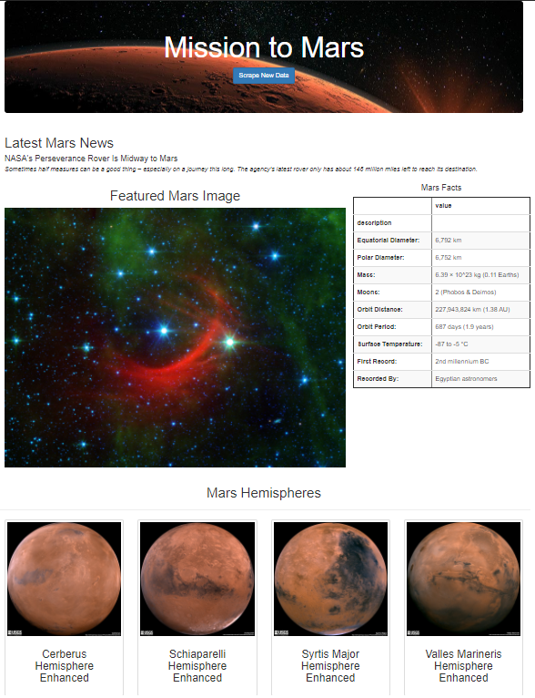
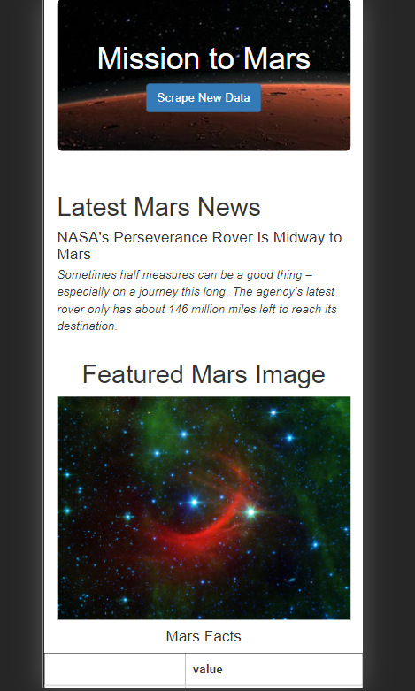
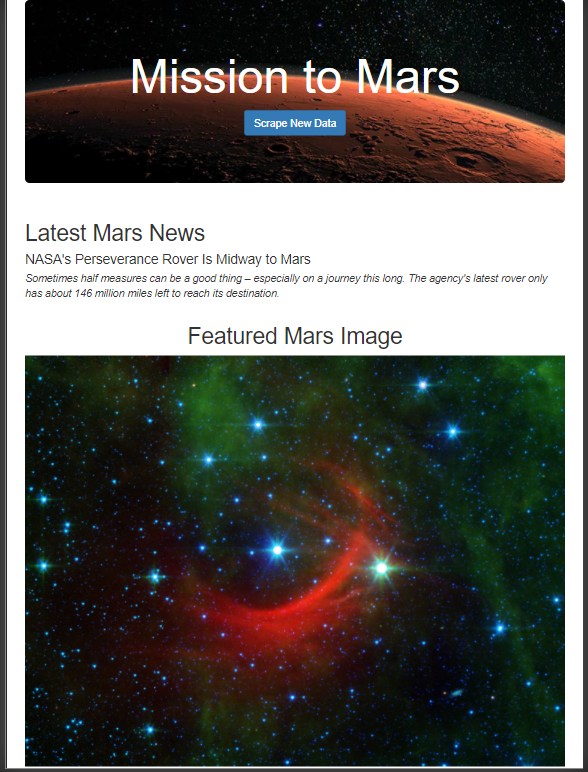

# Mission to Mars : A Beginners Introduction to Web Scraping
This application scrapes the web for the latest news and facts about the planet Mars.  Since I am interested in the different hemispheres as well, the app also scrapes full-size pictures for each hemisphere and displays all the information on one webpage. All this is done in a sequence using various Python, the Flask module and Bootstrap 3.3.7. 

## Purpose 
- To showcase my interest in the red planet Mars. 
- Showcase various facts and the latest news about Mars. 
- To be able to continuously refresh this information.
## Resources
- jupyter notebook v6.1.1
- VS code v1.50.1
- python 3.8.5
- CSS 
- HTML
## Summary 
- Web scraping carried out on various sites
    1. NASA Mars News - collecting news briefs, titles
    [link](https://mars.nasa.gov/news/)
    2. JPL Space Images - Collecting the featured images
    [link](https://www.jpl.nasa.gov/spaceimages/?search=&category=Mars)
    3. Space facts - Mars fact page, and converted the webpage info into a table using pandas, eg. diameter, mass etc.
    [link](http://space-facts.com/mars/)
    4. Mars weather - Collecting information and data on the weather on Mars.
    [link](https://mars.nasa.gov/insight/weather/)
    5. Hemispheres of Mars - both thumbnail images, full resolution and the hemisphere names are recorded. 
    [link](https://astrogeology.usgs.gov/search/results?q=hemisphere+enhanced&k1=target&v1=Mars)

## Webpage Result

&nbsp;

#### Toggle Screen for mobile platforms.

&nbsp;

*Mobile Phones*

&nbsp;

*Tablets*